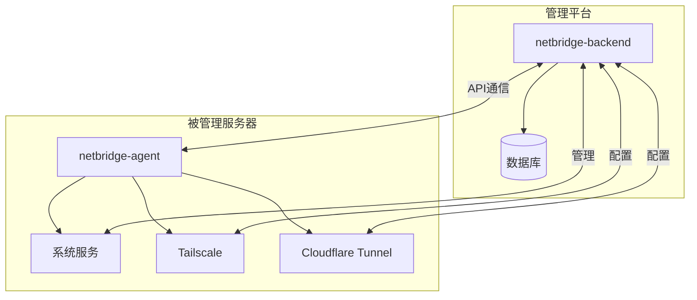

# NetBridge 项目 Code Wiki

## 项目概述

NetBridge 是一个服务器管理平台，由两部分组成：

- **netbridge-agent**：Go 语言编写的代理程序，部署在被管理的服务器上，负责服务器状态监控、服务启停控制、任务执行、心跳上报等功能。
- **netbridge-backend**：Java Spring Boot 编写的后端服务，负责管理服务器、服务、任务、用户等核心业务逻辑。

## 项目架构

### 整体架构



### 模块划分

| 模块 | 职责 | 技术栈 |
|------|------|--------|
| netbridge-agent | 服务器代理，负责执行任务、监控状态 | Go |
| netbridge-backend | 后端服务，负责业务逻辑和数据管理 | Java Spring Boot |

## netbridge-agent 详细说明

### 目录结构

```
netbridge-agent/
├── build/             # 构建脚本
├── cmd/               # 命令行入口
│   └── agent/         # Agent 主入口
├── configs/           # 配置文件
├── internal/          # 内部实现
│   ├── api/           # API 客户端
│   ├── app/           # 应用主逻辑
│   ├── command/       # 命令执行
│   ├── config/        # 配置管理
│   ├── executor/      # 任务执行器
│   ├── heartbeat/     # 心跳服务
│   ├── logger/        # 日志
│   ├── monitor/       # 监控采集
│   ├── service/       # 服务管理
│   ├── tailscale/     # Tailscale 管理
│   ├── task/          # 任务处理
│   └── tunnel/        # Tunnel 管理
├── pkg/               # 公共包
│   ├── constant/      # 常量
│   └── model/         # 数据模型
├── scripts/           # 安装脚本
└── README.md          # 说明文档
```

### 核心模块

#### 1. app 模块

**职责**：Agent 应用的核心逻辑，负责初始化各个组件、处理注册、心跳和任务循环。

**关键类/函数**：
- `App`：应用主结构体，包含配置、日志、API 客户端等组件
- `New(cfg *config.Config, log *logger.Logger) (*App, error)`：创建应用实例
- `Run(ctx context.Context) error`：运行应用，处理注册、心跳和任务循环
- `ensureRegistered(ctx context.Context) error`：确保 Agent 已注册
- `runHeartbeat(ctx context.Context) error`：发送心跳
- `runTaskCycle(ctx context.Context) error`：执行任务循环

**文件**：[app.go](file:///workspace/netbridge-agent/internal/app/app.go)

#### 2. api 模块

**职责**：与后端服务通信的 API 客户端。

**关键类/函数**：
- `Client`：API 客户端结构体
- `Register(ctx context.Context, req model.RegisterRequest) (*model.RegisterResponse, error)`：注册 Agent
- `Heartbeat(ctx context.Context, req model.HeartbeatRequest) error`：发送心跳
- `PullTask(ctx context.Context, req model.PullTaskRequest) (*model.PullTaskResponse, error)`：拉取任务
- `ReportTaskResult(ctx context.Context, taskID int64, req model.TaskResultRequest) error`：上报任务结果
- `ReportLog(ctx context.Context, req model.LogRequest) error`：上报日志

**文件**：[client.go](file:///workspace/netbridge-agent/internal/api/client.go)

#### 3. service 模块

**职责**：管理系统服务的启停和状态检查。

**关键类/函数**：
- `Manager`：服务管理器
- `NewManager(runner command.Runner, log *logger.Logger, mappings map[string]ServiceMapping) *Manager`：创建服务管理器
- `Check(name string) (Status, error)`：检查服务状态
- `Start(name string) (Status, error)`：启动服务
- `Stop(name string) (Status, error)`：停止服务
- `Restart(name string) (Status, error)`：重启服务

**文件**：[manager.go](file:///workspace/netbridge-agent/internal/service/manager.go)

#### 4. tailscale 模块

**职责**：管理 Tailscale 网络访问。

**关键类/函数**：
- `Client`：Tailscale 客户端
- `NewClient(runner command.Runner, log *logger.Logger, cfg config.TailscaleConfig, dataDir string) *Client`：创建 Tailscale 客户端
- `Ensure(ctx context.Context, payload model.TaskPayload) (model.TailscaleAction, error)`：确保 Tailscale 配置
- `Teardown(ctx context.Context, payload model.TaskPayload) (model.TailscaleAction, error)`：清理 Tailscale 配置
- `Observe(ctx context.Context) (model.TailscaleAction, error)`：观察 Tailscale 状态

**文件**：[client.go](file:///workspace/netbridge-agent/internal/tailscale/client.go)

#### 5. tunnel 模块

**职责**：管理 Cloudflare Tunnel 网络访问。

**关键类/函数**：
- `Controller`：Tunnel 控制器
- `NewController(runner command.Runner, log *logger.Logger, cfg config.TunnelConfig, dataDir string) *Controller`：创建 Tunnel 控制器
- `Ensure(ctx context.Context, payload model.TaskPayload) (model.TunnelAction, error)`：确保 Tunnel 配置
- `Teardown(ctx context.Context, payload model.TaskPayload) (model.TunnelAction, error)`：清理 Tunnel 配置
- `Observe(ctx context.Context) (model.TunnelAction, error)`：观察 Tunnel 状态

**文件**：[controller.go](file:///workspace/netbridge-agent/internal/tunnel/controller.go)

#### 6. executor 模块

**职责**：执行任务，协调服务、Tailscale 和 Tunnel 的操作。

**关键类/函数**：
- `Executor`：任务执行器
- `New(serviceManager *svcctl.Manager, tailscaleClient *tailscale.Client, tunnelController *tunnel.Controller) *Executor`：创建任务执行器
- `Execute(ctx context.Context, task *model.PullTaskResponse) (model.TaskResult, string)`：执行任务

**文件**：[executor.go](file:///workspace/netbridge-agent/internal/executor/executor.go)

### 配置说明

Agent 使用 YAML 配置文件，主要配置项包括：

- `serverUrl`：后端服务地址
- `installToken`：安装令牌（首次注册时使用）
- `heartbeatInterval`：心跳间隔
- `taskPollInterval`：任务拉取间隔
- `serviceMappings`：服务映射配置
- `tailscale`：Tailscale 配置
- `tunnel`：Tunnel 配置

**文件**：[agent.yaml](file:///workspace/netbridge-agent/configs/agent.yaml)

### 运行方式

1. 配置 `configs/agent.yaml` 文件
2. 执行命令：`go run ./cmd/agent -config ./configs/agent.yaml`
3. 首次运行会自动注册并生成状态文件

**安装脚本**：
- Linux：[install.sh](file:///workspace/netbridge-agent/scripts/install.sh)
- Windows：[install.ps1](file:///workspace/netbridge-agent/scripts/install.ps1)

## netbridge-backend 详细说明

### 目录结构

```
netbridge-backend/
├── netbridge-dependencies/          # 统一依赖版本
├── netbridge-framework/             # 框架和公共组件
│   ├── netbridge-common/            # 通用工具类
│   ├── netbridge-spring-boot-starter-web/         # Web 基础配置
│   ├── netbridge-spring-boot-starter-mybatis/     # MyBatis 配置
│   ├── netbridge-spring-boot-starter-security/    # 安全配置
│   ├── netbridge-spring-boot-starter-redis/       # Redis 配置
│   └── netbridge-spring-boot-starter-swagger/     # Swagger 配置
├── netbridge-module-user/           # 用户模块
├── netbridge-module-server/         # 服务器模块
├── netbridge-module-service/        # 服务模块
├── netbridge-module-agent/          # Agent 模块
├── netbridge-module-task/           # 任务模块
├── netbridge-module-config/         # 配置模块
├── netbridge-module-log/            # 日志模块
├── netbridge-module-monitor/        # 监控模块
├── netbridge-module-tunnel/         # Tunnel 模块
├── netbridge-module-tailscale/      # Tailscale 模块
├── netbridge-server/                # 启动模块
└── README.md                        # 说明文档
```

### 核心模块

#### 1. 模块结构约定

每个业务模块默认拆成两层：
- `*-api`：放 DTO、VO、枚举、接口契约
- `*-biz`：放 Controller、Service、Entity、Mapper、转换器、业务实现

#### 2. 框架模块

**netbridge-common**：通用常量、基础对象、工具类
**netbridge-spring-boot-starter-web**：统一响应、异常处理、Web 基础配置
**netbridge-spring-boot-starter-mybatis**：MyBatis Plus 扫描与持久层基础配置
**netbridge-spring-boot-starter-security**：认证与密码编码骨架
**netbridge-spring-boot-starter-redis**：缓存基础能力
**netbridge-spring-boot-starter-swagger**：OpenAPI 文档配置

#### 3. 业务模块

| 模块 | 职责 |
|------|------|
| netbridge-module-user | 用户、登录、权限、账号信息 |
| netbridge-module-server | 服务器注册信息、状态、心跳视图 |
| netbridge-module-service | 服务映射、端口、访问方式、启停控制 |
| netbridge-module-agent | Agent 注册、心跳、任务拉取与执行结果交互 |
| netbridge-module-task | 任务编排、状态流转、执行历史 |
| netbridge-module-config | 系统配置、密钥配置、平台参数 |
| netbridge-module-log | 运行日志、操作日志、Agent 上报日志 |
| netbridge-module-monitor | 服务器指标、服务可用性、监控面板查询 |
| netbridge-module-tunnel | Cloudflare Tunnel 相关能力、域名和通道状态 |
| netbridge-module-tailscale | Tailscale 设备、IP、MagicDNS 和网络接入能力 |

### 主入口

**文件**：[NetBridgeServerApplication.java](file:///workspace/netbridge-backend/netbridge-server/src/main/java/com/netbridge/server/NetBridgeServerApplication.java)

**核心注解**：
- `@EnableScheduling`：启用定时任务
- `@SpringBootApplication(scanBasePackages = "com.netbridge")`：Spring Boot 应用注解，指定扫描包

### 数据库

**文件**：[database_schema.sql](file:///workspace/docs/database_schema.sql)

## 关键依赖关系

### Agent 依赖

| 依赖 | 用途 | 来源 |
|------|------|------|
| Go 标准库 | 基础功能 | 内置 |
| YAML 解析 | 配置文件解析 | 外部依赖 |
| HTTP 客户端 | 与后端通信 | 内置 |

### Backend 依赖

| 依赖 | 用途 | 来源 |
|------|------|------|
| Spring Boot | 应用框架 | Maven |
| MyBatis Plus | ORM 框架 | Maven |
| Redis | 缓存 | Maven |
| Spring Security | 安全框架 | Maven |
| Swagger | API 文档 | Maven |
| Flyway | 数据库迁移 | Maven |

## 项目运行方式

### Agent 运行

1. 配置 `configs/agent.yaml` 文件，填写 `serverUrl` 和 `installToken`
2. 执行命令：`go run ./cmd/agent -config ./configs/agent.yaml`
3. 首次运行会自动注册并生成状态文件

### Backend 运行

1. 配置数据库连接
2. 执行命令：`mvn spring-boot:run -pl netbridge-server`
3. 访问 API 文档：`http://localhost:8080/swagger-ui.html`

## 核心功能流程

### Agent 注册流程

1. Agent 启动时检查本地状态文件
2. 如果未注册，使用 `installToken` 向后端注册
3. 注册成功后保存 `serverId` 和 `agentId` 到本地状态文件

### 心跳流程

1. Agent 定期收集服务器指标（CPU、内存、磁盘等）
2. 向后端发送心跳请求，包含服务器状态信息
3. 后端更新服务器状态

### 任务执行流程

1. Agent 定期从后端拉取任务
2. 根据任务类型执行相应操作（CHECK、START、STOP、RESTART）
3. 执行服务操作（如果需要）
4. 执行网络访问配置（Tailscale 或 Tunnel）
5. 收集执行结果并上报给后端
6. 上报执行日志

### 服务管理流程

1. Agent 根据配置的服务映射，将服务名映射到系统服务
2. 执行服务状态检查、启动、停止或重启操作
3. 收集服务操作结果

### 网络访问配置流程

1. 根据任务配置，选择使用 Tailscale 或 Cloudflare Tunnel
2. 执行相应的网络访问配置（确保或清理）
3. 收集网络访问操作结果

## 配置示例

### Agent 配置示例

```yaml
serverUrl: "http://localhost:8080"
installToken: "your-install-token"
heartbeatInterval: "30s"
taskPollInterval: "10s"
logLevel: "info"
dataDir: "./data"

serviceMappings:
  mysql-main:
    unit: "mysql"
  redis-main:
    unit: "redis"
  nginx-public:
    unit: "nginx"
    checkCommand: "systemctl is-active nginx"

tailscale:
  mode: "serve-http"
  binary: "tailscale"
  advertisePort: 0

tunnel:
  binary: "cloudflared"
  mode: "service-config"
  configPath: "/etc/cloudflared/config.yml"
```

## 监控与日志

### Agent 监控

- 定期采集服务器指标（CPU、内存、磁盘、网络等）
- 支持 Linux 下读取 `/proc` 文件系统获取详细信息
- 其他平台自动退化为基础监控

### 日志

- Agent 本地日志
- 向后端上报执行日志
- 后端统一管理日志

## 部署建议

1. **Agent 部署**：
   - 使用提供的安装脚本进行安装
   - 配置系统服务，确保 Agent 自动启动
   - 定期更新 Agent 版本

2. **Backend 部署**：
   - 使用 Docker 容器化部署
   - 配置数据库连接
   - 配置反向代理和 SSL
   - 定期备份数据库

3. **安全建议**：
   - 保护 `installToken`，避免泄露
   - 配置合适的网络访问控制
   - 定期更新系统和依赖

## 扩展与定制

1. **服务映射**：
   - 通过配置文件自定义服务映射
   - 支持自定义命令执行

2. **网络访问**：
   - 支持 Tailscale 和 Cloudflare Tunnel
   - 支持自定义命令模板

3. **监控扩展**：
   - 可扩展监控指标采集
   - 支持自定义监控项

4. **任务扩展**：
   - 可扩展任务类型
   - 支持自定义任务执行逻辑

## 故障排查

1. **Agent 注册失败**：
   - 检查 `serverUrl` 是否正确
   - 检查 `installToken` 是否有效
   - 检查网络连接

2. **任务执行失败**：
   - 检查服务映射配置
   - 检查网络访问配置
   - 查看 Agent 日志

3. **心跳失败**：
   - 检查网络连接
   - 检查后端服务是否正常
   - 查看 Agent 日志

4. **网络访问配置失败**：
   - 检查 Tailscale 或 Cloudflare Tunnel 安装
   - 检查配置参数
   - 查看 Agent 日志

## 总结

NetBridge 项目是一个功能完整的服务器管理平台，通过 Agent 和 Backend 的协同工作，实现了服务器状态监控、服务管理、网络访问配置等核心功能。项目采用模块化设计，具有良好的可扩展性和可维护性。

主要特点：
- 支持多服务器管理
- 支持服务启停控制
- 支持 Tailscale 和 Cloudflare Tunnel 网络访问
- 提供完整的监控和日志功能
- 支持自定义配置和扩展

通过 NetBridge，管理员可以方便地管理和监控多台服务器，实现服务的自动化管理和网络访问的灵活配置。