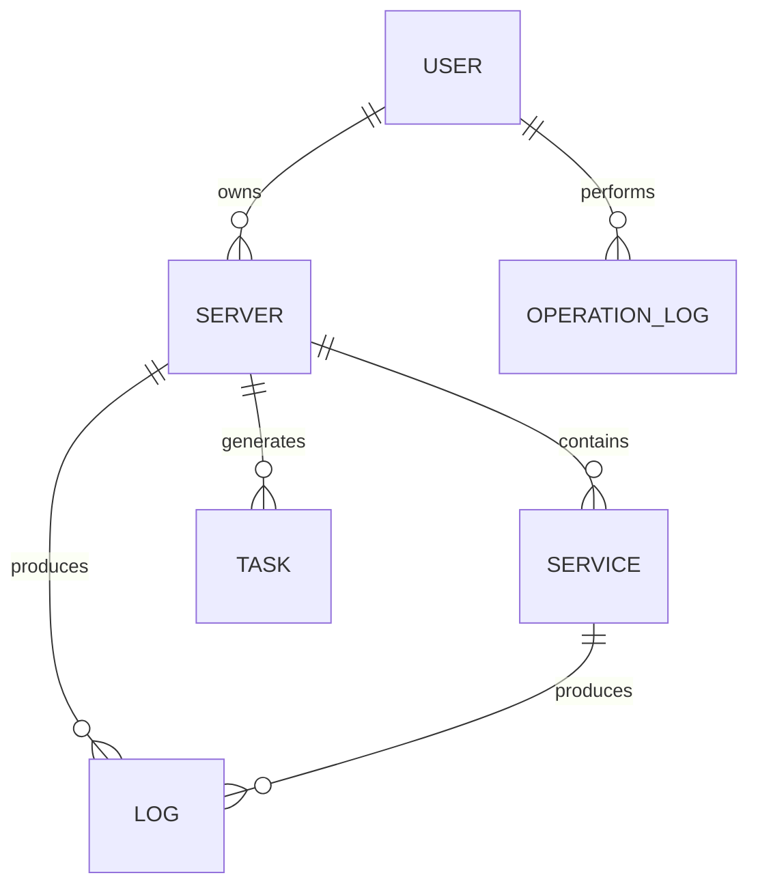

# NetBridge 数据库设计文档

## 1. 数据库概述

### 1.1 数据库选择
- **主数据库**：MySQL 8.0+
- **可选数据库**：PostgreSQL 14.0+

### 1.2 数据库设计原则
- 遵循关系型数据库设计规范
- 合理设计表结构和索引
- 确保数据一致性和完整性
- 考虑系统扩展性

## 2. 核心表结构设计

### 2.1 用户表（user）

| 字段名 | 数据类型 | 约束 | 描述 |
| :--- | :--- | :--- | :--- |
| `id` | `BIGINT` | `PRIMARY KEY, AUTO_INCREMENT` | 用户ID |
| `username` | `VARCHAR(50)` | `UNIQUE, NOT NULL` | 用户名 |
| `password` | `VARCHAR(255)` | `NOT NULL` | 密码（加密存储） |
| `email` | `VARCHAR(100)` | `UNIQUE, NOT NULL` | 邮箱 |
| `role` | `VARCHAR(20)` | `DEFAULT 'user'` | 角色（user/admin） |
| `status` | `TINYINT` | `DEFAULT 1` | 状态（1:活跃, 0:禁用） |
| `created_at` | `DATETIME` | `DEFAULT CURRENT_TIMESTAMP` | 创建时间 |
| `updated_at` | `DATETIME` | `DEFAULT CURRENT_TIMESTAMP ON UPDATE CURRENT_TIMESTAMP` | 更新时间 |

### 2.2 服务器表（server）

| 字段名 | 数据类型 | 约束 | 描述 |
| :--- | :--- | :--- | :--- |
| `id` | `BIGINT` | `PRIMARY KEY, AUTO_INCREMENT` | 服务器ID |
| `user_id` | `BIGINT` | `REFERENCES user(id)` | 所属用户ID |
| `hostname` | `VARCHAR(100)` | `NOT NULL` | 主机名 |
| `os` | `VARCHAR(50)` | `NOT NULL` | 操作系统 |
| `ip` | `VARCHAR(20)` | `NOT NULL` | 公网IP |
| `tailscale_ip` | `VARCHAR(20)` | `NULL` | Tailscale IP |
| `status` | `VARCHAR(20)` | `DEFAULT 'offline'` | 状态（online/offline/error） |
| `agent_version` | `VARCHAR(20)` | `NULL` | Agent版本 |
| `cpu` | `VARCHAR(50)` | `NULL` | CPU信息 |
| `memory` | `VARCHAR(50)` | `NULL` | 内存信息 |
| `disk` | `VARCHAR(50)` | `NULL` | 磁盘信息 |
| `last_heartbeat` | `DATETIME` | `NULL` | 最后心跳时间 |
| `created_at` | `DATETIME` | `DEFAULT CURRENT_TIMESTAMP` | 创建时间 |
| `updated_at` | `DATETIME` | `DEFAULT CURRENT_TIMESTAMP ON UPDATE CURRENT_TIMESTAMP` | 更新时间 |

### 2.3 服务表（service）

| 字段名 | 数据类型 | 约束 | 描述 |
| :--- | :--- | :--- | :--- |
| `id` | `BIGINT` | `PRIMARY KEY, AUTO_INCREMENT` | 服务ID |
| `server_id` | `BIGINT` | `REFERENCES server(id)` | 所属服务器ID |
| `name` | `VARCHAR(100)` | `NOT NULL` | 服务名称 |
| `type` | `VARCHAR(20)` | `NOT NULL` | 服务类型（MySQL/Redis/Nacos/Web/SSH） |
| `protocol` | `VARCHAR(10)` | `NOT NULL` | 协议（TCP/HTTP） |
| `port` | `INT` | `NOT NULL` | 服务端口 |
| `domain` | `VARCHAR(255)` | `NULL` | 绑定域名（HTTP服务） |
| `enabled` | `TINYINT` | `DEFAULT 0` | 是否启用（1:启用, 0:禁用） |
| `status` | `VARCHAR(20)` | `DEFAULT 'inactive'` | 状态（active/inactive/error） |
| `access_type` | `VARCHAR(20)` | `NOT NULL` | 访问类型（tailscale/tunnel） |
| `created_at` | `DATETIME` | `DEFAULT CURRENT_TIMESTAMP` | 创建时间 |
| `updated_at` | `DATETIME` | `DEFAULT CURRENT_TIMESTAMP ON UPDATE CURRENT_TIMESTAMP` | 更新时间 |

### 2.4 任务表（task）

| 字段名 | 数据类型 | 约束 | 描述 |
| :--- | :--- | :--- | :--- |
| `id` | `BIGINT` | `PRIMARY KEY, AUTO_INCREMENT` | 任务ID |
| `server_id` | `BIGINT` | `REFERENCES server(id)` | 所属服务器ID |
| `type` | `VARCHAR(20)` | `NOT NULL` | 任务类型（INSTALL/START/STOP/RESTART/DELETE） |
| `status` | `VARCHAR(20)` | `DEFAULT 'pending'` | 状态（pending/running/success/failed） |
| `payload` | `JSON` | `NULL` | 任务参数（JSON格式） |
| `result` | `JSON` | `NULL` | 任务结果（JSON格式） |
| `error_message` | `TEXT` | `NULL` | 错误信息 |
| `created_at` | `DATETIME` | `DEFAULT CURRENT_TIMESTAMP` | 创建时间 |
| `updated_at` | `DATETIME` | `DEFAULT CURRENT_TIMESTAMP ON UPDATE CURRENT_TIMESTAMP` | 更新时间 |
| `completed_at` | `DATETIME` | `NULL` | 完成时间 |

### 2.5 日志表（log）

| 字段名 | 数据类型 | 约束 | 描述 |
| :--- | :--- | :--- | :--- |
| `id` | `BIGINT` | `PRIMARY KEY, AUTO_INCREMENT` | 日志ID |
| `server_id` | `BIGINT` | `REFERENCES server(id)` | 所属服务器ID |
| `service_id` | `BIGINT` | `REFERENCES service(id)` | 所属服务ID（可为空） |
| `level` | `VARCHAR(10)` | `NOT NULL` | 日志级别（INFO/WARN/ERROR/DEBUG） |
| `content` | `TEXT` | `NOT NULL` | 日志内容 |
| `source` | `VARCHAR(50)` | `NOT NULL` | 日志来源（agent/tunnel/system） |
| `created_at` | `DATETIME` | `DEFAULT CURRENT_TIMESTAMP` | 创建时间 |

### 2.6 操作记录表（operation_log）

| 字段名 | 数据类型 | 约束 | 描述 |
| :--- | :--- | :--- | :--- |
| `id` | `BIGINT` | `PRIMARY KEY, AUTO_INCREMENT` | 操作记录ID |
| `user_id` | `BIGINT` | `REFERENCES user(id)` | 操作用户ID |
| `action` | `VARCHAR(50)` | `NOT NULL` | 操作类型 |
| `target_type` | `VARCHAR(20)` | `NOT NULL` | 操作目标类型（server/service/task） |
| `target_id` | `BIGINT` | `NOT NULL` | 操作目标ID |
| `details` | `JSON` | `NULL` | 操作详情（JSON格式） |
| `ip` | `VARCHAR(20)` | `NOT NULL` | 操作IP |
| `created_at` | `DATETIME` | `DEFAULT CURRENT_TIMESTAMP` | 操作时间 |

### 2.7 配置表（config）

| 字段名 | 数据类型 | 约束 | 描述 |
| :--- | :--- | :--- | :--- |
| `id` | `BIGINT` | `PRIMARY KEY, AUTO_INCREMENT` | 配置ID |
| `key` | `VARCHAR(50)` | `UNIQUE, NOT NULL` | 配置键 |
| `value` | `TEXT` | `NOT NULL` | 配置值 |
| `description` | `VARCHAR(255)` | `NULL` | 配置描述 |
| `created_at` | `DATETIME` | `DEFAULT CURRENT_TIMESTAMP` | 创建时间 |
| `updated_at` | `DATETIME` | `DEFAULT CURRENT_TIMESTAMP ON UPDATE CURRENT_TIMESTAMP` | 更新时间 |

## 3. 索引设计

### 3.1 用户表索引
- `PRIMARY KEY` (`id`)
- `UNIQUE INDEX` (`username`)
- `UNIQUE INDEX` (`email`)

### 3.2 服务器表索引
- `PRIMARY KEY` (`id`)
- `INDEX` (`user_id`)
- `INDEX` (`status`)
- `INDEX` (`last_heartbeat`)

### 3.3 服务表索引
- `PRIMARY KEY` (`id`)
- `INDEX` (`server_id`)
- `INDEX` (`type`)
- `INDEX` (`status`)
- `INDEX` (`enabled`)

### 3.4 任务表索引
- `PRIMARY KEY` (`id`)
- `INDEX` (`server_id`)
- `INDEX` (`type`)
- `INDEX` (`status`)
- `INDEX` (`created_at`)

### 3.5 日志表索引
- `PRIMARY KEY` (`id`)
- `INDEX` (`server_id`)
- `INDEX` (`service_id`)
- `INDEX` (`level`)
- `INDEX` (`created_at`)

### 3.6 操作记录表索引
- `PRIMARY KEY` (`id`)
- `INDEX` (`user_id`)
- `INDEX` (`target_type`, `target_id`)
- `INDEX` (`created_at`)

### 3.7 配置表索引
- `PRIMARY KEY` (`id`)
- `UNIQUE INDEX` (`key`)

## 4. 数据关系图

## 5. 数据迁移策略

### 5.1 初始化数据
- 系统配置项
- 默认管理员账户
- 基础配置参数

### 5.2 数据备份
- 定期全量备份
- 增量备份
- 备份恢复测试

### 5.3 数据清理
- 日志数据定期清理
- 任务历史数据归档
- 过期数据处理

## 6. 性能优化

### 6.1 查询优化
- 合理使用索引
- 避免全表扫描
- 优化复杂查询

### 6.2 写入优化
- 批量插入
- 事务管理
- 避免频繁更新

### 6.3 存储优化
- 合理设置字段类型
- 分区表设计
- 数据压缩

## 7. 安全考虑

### 7.1 数据加密
- 密码加密存储
- 敏感数据加密
- 传输加密

### 7.2 访问控制
- 最小权限原则
- 数据访问审计
- 防止SQL注入

### 7.3 数据完整性
- 外键约束
- 唯一性约束
- 非空约束

## 8. 数据库版本管理

### 8.1 版本控制
- 使用数据库迁移工具
- 版本号管理
- 变更记录

### 8.2 回滚策略
- 备份机制
- 回滚脚本
- 测试环境验证

## 9. 监控与维护

### 9.1 监控指标
- 连接数
- 查询性能
- 存储空间
- 复制状态

### 9.2 维护计划
- 定期优化
- 索引重建
- 统计信息更新

## 10. 扩展性考虑

### 10.1 水平扩展
- 分库分表
- 读写分离
- 集群部署

### 10.2 垂直扩展
- 硬件升级
- 配置优化
- 存储扩容

### 10.3 数据分片
- 按用户分片
- 按时间分片
- 按业务分片