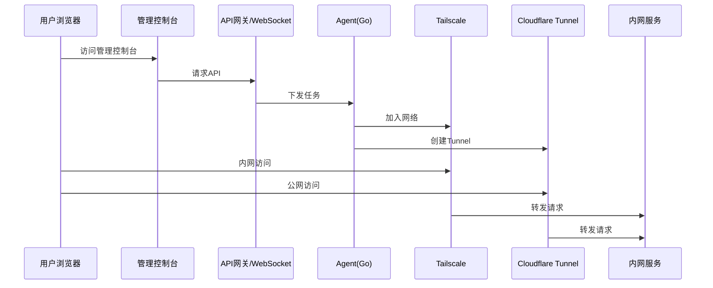
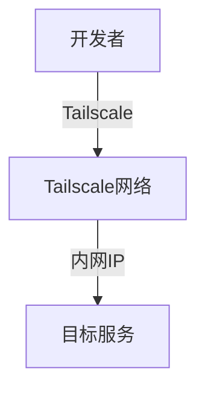
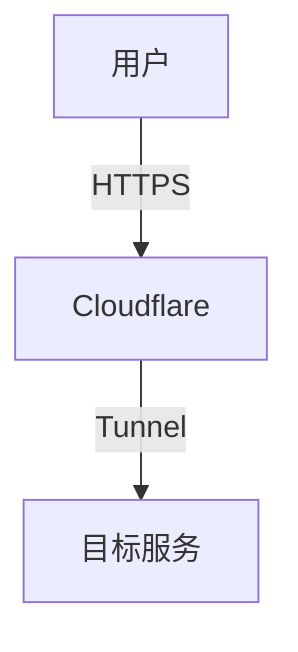

# NetBridge 技术架构文档

## 1. 系统架构

### 1.1 总体架构

### 1.2 组件关系

| 组件 | 职责 | 技术栈 |
|------|------|--------|
| 管理控制台 | 用户界面、服务管理 | Vue3 + Element Plus |
| API网关 | 接口管理、WebSocket通信 | Spring Boot 3 |
| Agent | 执行引擎、服务监控 | Go |
| Tailscale | 内网访问 | Tailscale客户端 |
| Cloudflare Tunnel | 公网访问 | cloudflared |

## 2. 技术选型

### 2.1 后端技术

| 技术 | 版本 | 用途 |
|------|------|------|
| Spring Boot | 3.0+ | 应用框架 |
| MyBatis Plus | 3.5+ | ORM框架 |
| Redis | 7.0+ | 缓存、Session管理 |
| WebSocket | - | 实时通信 |
| JWT | - | 认证授权 |

### 2.2 前端技术

| 技术 | 版本 | 用途 |
|------|------|------|
| Vue | 3.0+ | 前端框架 |
| Element Plus | 2.0+ | UI组件库 |
| ECharts | 5.0+ | 数据可视化 |
| Axios | - | HTTP客户端 |

### 2.3 Agent技术

| 技术 | 版本 | 用途 |
|------|------|------|
| Go | 1.20+ | 开发语言 |
| Tailscale | 最新版 | 内网访问 |
| Cloudflared | 最新版 | 公网访问 |

### 2.4 数据库

| 技术 | 版本 | 用途 |
|------|------|------|
| MySQL | 8.0+ | 主数据库 |
| PostgreSQL | 14.0+ | 可选数据库 |

## 3. 核心模块设计

### 3.1 用户系统

#### 3.1.1 功能设计
- 注册/登录
- JWT鉴权
- 多设备登录管理
- 权限控制

#### 3.1.2 技术实现
- 使用Spring Security进行认证授权
- JWT token生成与验证
- Redis存储用户会话

### 3.2 服务器管理

#### 3.2.1 功能设计
- 服务器添加（生成安装命令）
- 服务器状态监控（WebSocket实时）
- 服务器信息展示
- 服务器管理（删除/重命名）

#### 3.2.2 技术实现
- WebSocket连接管理
- 心跳机制
- 服务器状态更新

### 3.3 服务映射管理

#### 3.3.1 功能设计
- 服务添加
- 服务状态管理
- 自动生成访问地址
- 服务监控

#### 3.3.2 技术实现
- 服务配置管理
- 端口检测
- 服务状态检测

### 3.4 Agent管理

#### 3.4.1 功能设计
- Agent注册
- 任务调度
- 日志上报
- 状态监控

#### 3.4.2 技术实现
- gRPC通信
- 任务队列
- 命令执行控制

### 3.5 Tunnel管理

#### 3.5.1 功能设计
- 自动创建Tunnel
- 域名绑定
- Tunnel状态管理

#### 3.5.2 技术实现
- Cloudflare API集成
- Tunnel配置生成
- 状态监控

### 3.6 Tailscale管理

#### 3.6.1 功能设计
- 自动加入网络
- IP管理
- MagicDNS配置

#### 3.6.2 技术实现
- Tailscale API集成
- Auth Key管理
- 网络配置

### 3.7 监控系统

#### 3.7.1 功能设计
- 服务器资源监控
- 服务状态监控
- 告警管理

#### 3.7.2 技术实现
- 指标采集
- 数据存储
- 告警触发

### 3.8 日志系统

#### 3.8.1 功能设计
- Agent日志
- Tunnel日志
- 操作日志

#### 3.8.2 技术实现
- 日志收集
- 日志存储
- 日志查询

## 4. 网络设计

### 4.1 内网访问

### 4.2 公网访问

## 5. 安全设计

### 5.1 核心安全策略
- Token一次性使用，5分钟过期
- HTTPS全链路加密
- 最小权限原则
- 操作审计

### 5.2 Agent安全
- 命令白名单
- 禁止执行任意shell命令
- 执行超时控制
- 权限限制

### 5.3 数据安全
- 密码加密存储
- 敏感数据传输加密
- 数据访问控制

## 6. 部署架构

### 6.1 服务部署
- 管理控制台：容器化部署
- API服务：集群部署
- Agent：服务器本地部署

### 6.2 高可用设计
- 多实例部署
- 负载均衡
- 故障自动切换

### 6.3 扩展性设计
- 微服务架构
- 插件化设计
- 配置中心

## 7. 技术风险评估

| 风险 | 影响 | 应对措施 |
|------|------|----------|
| Tailscale依赖 | 服务不可用 | 备用方案、监控告警 |
| Cloudflare依赖 | 公网访问中断 | 多Tunnel配置、监控告警 |
| Agent稳定性 | 服务监控中断 | 心跳机制、自动重启 |
| 安全漏洞 | 系统被攻击 | 定期安全审计、漏洞扫描 |

## 8. 技术 roadmap

### 8.1 第一阶段
- 核心架构搭建
- 用户系统实现
- Agent基础功能
- Tailscale集成

### 8.2 第二阶段
- 服务映射管理
- Tunnel集成
- 连通性检测
- 基础监控

### 8.3 第三阶段
- 高级监控系统
- 日志系统
- 权限管理
- 多租户支持

### 8.4 第四阶段
- 高可用优化
- 性能优化
- 告警系统
- 商业化功能

## 9. 技术文档维护

- 文档版本控制
- 技术栈更新记录
- 架构变更记录
- 性能优化记录